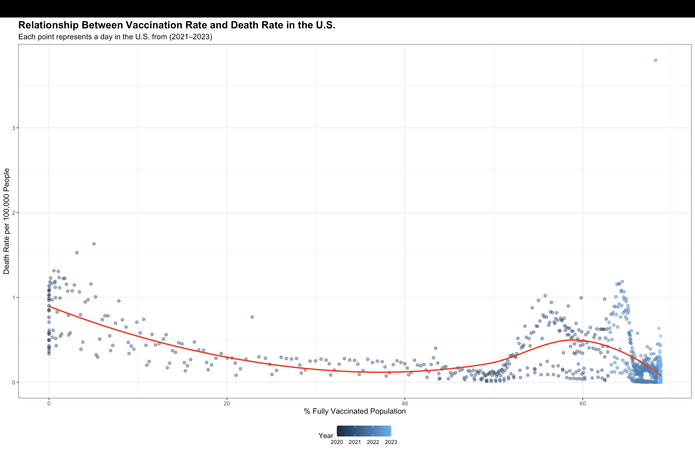

# Global COVID-19 Trends: Cases, Vaccinations, and Healthcare Burden

This project investigates how the COVID-19 pandemic affected countries differently by analyzing infection trends, vaccination effectiveness, and ICU usage patterns. Using global datasets, we explore the relationship between public health interventions and outcomes through visual and statistical analysis in R.

---

## Overview

COVID-19 reshaped global health policy, overwhelmed hospitals, and challenged public infrastructure. In this project, we use publicly available data from trusted sources to answer the following questions:

1. **How did daily case counts change across major countries over time?**
2. **What is the relationship between vaccination rates and death rates in the US?**
3. **How did ICU capacity respond to COVID-19 waves across countries?**

Through careful data cleaning, transformation, and visualization in R, we aim to uncover patterns that could inform future pandemic responses.

---

## Interesting Insight

Countries with high vaccination rates generally experienced lower COVID-19 death rates, but this trend wasn’t uniform. Some well-vaccinated countries still faced high mortality, hinting at the role of health infrastructure and response time.

*Figure: A scatterplot showing the relationship between full vaccination rates and COVID-19 death rates per 100,000 population. Most countries trend downward, but a few outliers suggest confounding variables.*

---

## Repo Structure

- **`final_report.qmd`** – The Quarto source file containing the full written analysis.
- **`final_report.pdf`** – The rendered final report, submitted for grading.
- **`README.md`** – This file, summarizing the project and repo layout.

### 🗂️ Folders

- **`/raw_data`** – All raw data used for analysis:
  - `owid_covid_data.csv` – COVID-19 data from Our World in Data.
  - `covid_datahub_global.csv` – Global data from the COVID-19 Data Hub.
  - `jh_confirmed_cases.csv` – Time series data of confirmed cases from Johns Hopkins.

  - **`/tidied_data`** – All cleaned data used for analysis:
  - `owid_covid_data_filtered_final.csv` – COVID-19 data from Our World in Data.
  - `covid_datahub_USA_filtered.csv` – Global data from the COVID-19 Data Hub.
  - `jh_confirmed_cases_country_level.csv` – Time series data of confirmed cases from Johns Hopkins.

- **`/code`** – Scripts for reproducible analysis:
  - `01_fetch_data.R` – Downloads and stores datasets.
  - `02_clean_transform.R` – Cleans and reshapes the data.
  - `03_visualizations.R` – Generates plots for the final report.

- **`/figures`** – Visuals used in the report and README:
  - `cases_over_time.png`
  - `icu_utilization.png`
  - `death_vs_vax.png`

---

## Data Sources and Acknowledgements

- **Our World in Data**: [https://ourworldindata.org/coronavirus](https://ourworldindata.org/coronavirus)
- **COVID-19 Data Hub R Package**: [https://covid19datahub.io/](https://covid19datahub.io/)
- **Johns Hopkins CSSE Time Series**: [https://github.com/CSSEGISandData/COVID-19](https://github.com/CSSEGISandData/COVID-19)

We also acknowledge the developers of `tidyverse`, `ggplot2`, `COVID19`, and `readr` R packages for making this analysis possible.

---

## Authors

- **Li Zhu** 
- **Osilan**  
- **AlMamari**

For questions or collaboration, feel free to reach out via GitHub or email.
